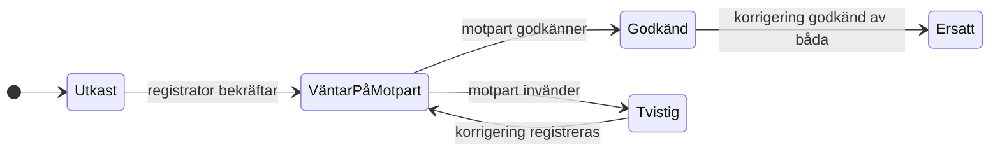

# Mitt & Ditt — lösningsförslag och feedback på scopet

**Status:** beslutat och påbörjat – etapp 0 och 1 levererade · **Datum:** 2026-08-21 · **Underlag:** uppdragsbeskrivningen, Samboavtal/delägaravtal V8 (punkt 1–28 + bilaga 1–4), Avräkningsmodell V8 (alla tre flikar inkl. de dolda beräkningskolumnerna O–AS), Bilkollens kodbas.

Det här dokumentet beskriver lösningen som jag tycker att den ska byggas. Där jag avviker från eller kompletterar uppdragsbeskrivningen säger jag det uttryckligen och motiverar varför. Sist finns byggordning och de få frågor som behöver svar — med rekommenderade default-svar så att bygget inte blockeras.

---

## 1. Samlad bedömning

Scopet är ovanligt väl genomarbetat: avtalet, Excel-arket och uppdragsbeskrivningen hänger ihop och beräkningsreglerna är entydiga nog att implementera deterministiskt. Jag har verifierat uppdragsbeskrivningens formler mot arkets faktiska formler och mot avtalets punkter 7–15 — de stämmer överens, med några nyanser som beskrivs i avsnitt 4.

Mina viktigaste synpunkter i korthet:

1. **Beräkningsmotorn ska vara en exakt, versionerad och golden-testad implementation av avtalet** — inte en app-funktion bland andra. Den byggs först, fristående, och verifieras mot arkets exempel innan någon skärm byggs. (Avsnitt 2.)
2. **Kostnader utanför modellen (BRF-avgift, försäkring) saknar helt hantering i Excel-arket** — arket ignorerar dem. Uppdragsbeskrivningen kräver 50/50-visning och krona-för-krona-reglering, så appen blir första stället där detta faktiskt förs. Det är rätt, men det är ny funktionalitet, inte en portering. (Avsnitt 3.1.)
3. **Andelarna är preliminära i prognosläge — och det måste synas.** Eftersom värdet per andelsenhet beror på antaget slutvärde ändras även *historiska* enhetsöverföringar när antagandet ändras (avtal 6.4). Översikten får aldrig presentera andelarna som fastställda. (Avsnitt 2.4.)
4. **Vissa delar bör medvetet skjutas till v2**: dödsfallsflödet, notiser/e-post, native-app, komplett revisionsexport. (Avsnitt 3.9.)
5. **En infrastrukturfråga behöver svar före backend-bygget**: Lovable Cloud som Bilkollen, eller fristående Supabase. Motorn och UI:t byggs identiskt oavsett. (Avsnitt 7, fråga 1.)

---

## 1b. Fattade beslut

Alla frågor i avsnitt 7 är besvarade. Det här gäller nu:

| Fråga | Beslut |
|---|---|
| Infrastruktur | **Ingen Lovable- eller Supabase-koppling.** Container-paketerad app + Postgres, körs på en DigitalOcean-droplet. Se avsnitt 5.0. |
| Korrigeringar | Ersättningssemantik (3.2). |
| Registratorns godkännande | Sker i registreringsflödet (3.3). |
| Prognosens standardantagande | "Avräkning idag med oförändrat värde" (2.4). |
| 50/50-liggaren | Med i v1 (3.1). |
| Konfigurerbarhet | Parametrar ja, struktur nej. Se avsnitt 1c. |

## 1c. Hur konfigurerbara avtalets regler ska vara

Kortfattat: **avtalets parametrar ska vara konfigurerbara, dess struktur ska inte vara det.** Gränsen är inte teknisk utan följer av avtalets punkt 25.1.

**Konfigurerbart i tjänsten** – detta bor i databasen per hushåll och avtalsversion, och paret kan ändra det själva:

- startdag, startvärde, kapitalinsatser, startenheter och totalt antal andelsenheter,
- kostnadsslagens klassificering (ingår / ingår inte), med giltighetsdatum och bådas godkännande,
- fördelningen för kostnadsslag utanför enhetsmodellen (50/50 eller annat),
- vilka kostnadsslag som minskar låneskulden,
- särskild kostnadsnyckel per enskild transaktion,
- formella ägarandelar,
- fristerna i separationsprocessen och tioprocentsregeln vid värdering (som `ExitPolicy`).

**Inte konfigurerbart** – detta är avtalets konstruktion, och punkt 25.1 kräver separat undertecknat tilläggsavtal för att ändra det:

- den linjära värdeformeln,
- att en överbetalning omvandlas till andelsenheter till dagens enhetsvärde,
- att transaktioner behandlas kronologiskt och nettas per betalningsdag,
- att kostnadsnyckeln är andelarna omedelbart före transaktionen,
- spärrarna vid negativt nettokapital och otillräckliga enheter,
- att samma belopp aldrig blir både enheter och fordran,
- slutavräkningsregeln och tremånadersregeln.

Skulle tjänsten låta någon ändra detta med ett reglage vore appen inte längre ett bevisverktyg för avtalet – den skulle tyst kunna räkna på något annat än det parterna undertecknat. **Vägen att ändra dem finns**, men den går genom tilläggsavtalsflödet: ett undertecknat dokument laddas upp, båda bekräftar, och först då låses motsvarande fält upp. Det är en avsiktlig spärr, inte en begränsning i koden.

Motorn är därför byggd parameterdriven men strukturfast: `AgreementParams`, `CostCategoryRule[]` och `ExitPolicy` är indata, medan beräkningsgången ligger i koden och skyddas av testsviten.

---

## 2. Beräkningsmotorn — systemets kärna

### 2.1 Ren, deterministisk, versionerad

Motorn byggs som en fristående TypeScript-modul (`src/lib/engine/`) utan beroenden på databas, React eller nätverk:

```
EngineInput (snapshot)  →  beräkning  →  EngineResult (händelser + slutlägen + kontroller)
```

- **Input:** avtalsparametrar (startdag, startvärde, initialt lån, startenheter per part, totala enheter), slutpunkt (slutdag, slutvärde, läge `prognos`/`slutlig`), gällande kostnadsklassificeringar med giltighetsdatum, alla godkända transaktioner med betalningar/förmåner per part, lånesaldohändelser.
- **Output:** per betalningsdag — linjärt värde, använt lånesaldo, nettokapital, värde per enhet, dagens nettning, enhetsöverföring, ev. personlig fordran — samt slutliga enheter/andelar per part, 50/50-saldot utanför modellen, och automatiska kontroller (enhetssumma, andelssumma, positionssumma).
- **`ENGINE_VERSION`** exporteras och stämplas på varje sparad körning. Varje slutavräkning kan återskapas ur (avtalsversion, godkända transaktioner, lånesaldon, slutdag, slutvärde, motorversion) — precis som uppdragsbeskrivningen kräver.
- **Motorn räknar alltid om från början.** Ingen inkrementell state. Det gör avtalets omräkningskrav (10.5, 11.4 — "räkna om från ursprungliga betalningsdagen") trivialt: en korrigering ändrar bara inputen, och nästa körning blir automatiskt rätt.

### 2.2 Precision och avrundning — ett beslut uppdragsbeskrivningen inte täcker

Arket räknar i flyttal och nöjer sig med toleranskontroller (`ABS(...)<0,01`). För ett bevisverktyg vill jag ha en uttalad policy:

- Belopp hanteras internt i **öre** (heltal) där det går; enheter och andelar som decimaltal med **6 decimalers dokumenterad precision** (enheter är per definition bråktal — bilaga 1 exempel 6 ger 6 666,67 enheter).
- **Ingen avrundning i mellansteg.** Avrundning sker endast vid presentation (kronor: 2 decimaler; andelar: 4 decimaler, som avtalets 86,9565 %) och i slutavräkningens utbetalningsrader (hela ören, dokumenterad halv-upp-regel).
- **Verifieringstolerans mot V8-arket: ±1 kr** per slutposition. Importflödet (avsnitt 5.7) visar avvikelser mot arkets siffror explicit i importrapporten.
- Dagräkning görs i **kalenderdagar** (`differenceInCalendarDays`), aldrig via timestamps — ekonomiska datum lagras som `date` och kan inte förskjutas av tidszoner.

### 2.3 Trogen avtalet, renare än arket

Arkets konstruktion "sista godkända raden på dagen bär hela dagens nettotransfer" är ett kalkylblads-trick. Motorn gör samma sak strukturerat: transaktioner grupperas per betalningsdag, varje posts över-/underbetalning beräknas med sin nyckel (ordinarie rekursiv nyckel eller särskild nyckel per post), dagens skillnader summeras, och **en** nettoöverföring görs per dag med lånesaldot efter dagens samtliga amorteringar (avtal 8.3, 9.2, 10.3). Registreringsordning kan aldrig påverka utfallet eftersom motorn sorterar på betalningsdag och nettar per dag.

Spärrarna implementeras exakt som avtalet och arket:

- Nettokapital ≤ 0 → ingen överföring, hela överbetalningen blir personlig fordran (9.4).
- Överföring begränsas till motpartens tillgängliga enheter; överskott blir fordran (10.4).
- Samma belopp kan aldrig bli både enheter och fordran (10.2) — motorn returnerar omvandlat belopp och fordransbelopp som separata, summakontrollerade fält.
- **Fordringar omvandlas aldrig retroaktivt.** En överbetalning som inte kunde omvandlas på sin betalningsdag förblir nominell fordran och regleras i kronor (löpande eller i slutavräkningen). Så fungerar både avtalet (14.5) och arket, och så bygger vi.

### 2.4 Prognosläge: preliminära andelar är en produktegenskap

I prognosläge beror värdet per enhet på antaget slutvärde och antagen slutdag — alltså ändras även redan gjorda överföringar när antagandet ändras. Det är avsiktligt (avtal 6.4) men kontraintuitivt. Därför:

- Översikten visar alltid vilken beräkningsgrund som gäller: **"Prognos (antaget slutvärde X, slutdag Y)"** eller **"Slutavräkning"**.
- Andelar i prognosläge etiketteras "preliminära" med en "Vad betyder detta?"-förklaring som visar samma siffror under två olika antaganden.
- **Standardantagande** (min rekommendation, se fråga 5): *"avräkning idag till startvärdet"* — slutdag = idag, slutvärde = startvärde. Det är det mest neutrala läget ("vad händer om vi avräknar nu utan värdeförändring?") och kräver inga gissningar om marknaden. Parterna kan spara egna scenarier i simulatorn och välja ett som översiktens standard.

### 2.5 Testning

- **Golden tests** som återskapar avtalets bilaga 1, exempel 1–10, med exakta förväntade tal (8 000 enheter för tvättmaskinen, 5 600 kr ränteöverbetalning, 6 666,67 enheter vid sen betalning, 4 900 000 kr linjärt mellanvärde, osv.).
- **Egenskapstester:** symmetri (byt parternas roller → speglat resultat), ordningsoberoende (blanda registreringsordning → identiskt resultat), enhetskonservering (summan alltid = totala startenheter), summakontroller (slutpositioner = försäljningsnetto, andelar = 100 %).
- **Kantfall:** betalningsdag före startdag/efter slutdag (avvisas respektive flaggas, som arkets KONTROLLERA-kolumn), slutdag = startdag, negativt försäljningsnetto, negativ nettokostnad, blandade särskilda nycklar samma dag, amortering och annan kostnad samma dag.
- Testfixturer checkas in som JSON härledda ur arket — själva V8-filen (privat dokument) checkas inte in i repot.

---

## 3. Feedback på scopet — vad jag föreslår ändras, förtydligas eller skjuts upp

### 3.1 Kostnader utanför modellen behöver en egen, enkel liggare

Excel-arket **ignorerar** poster vars kostnadsslag är "Ingår inte" — de blir inaktiva rader utan någon beräkning alls. Uppdragsbeskrivningen kräver mer: 50/50-visning och krona-för-krona-reglering när någon betalat mer än sin del. Jag föreslår:

- Samma transaktionsregistrering och godkännandeflöde används för alla kostnader; kostnadsslagets klassificering på betalningsdagen avgör om posten går in i enhetsmodellen eller i **50/50-liggaren** (eller annan avtalad fördelning per kostnadsslag).
- Liggaren är en löpande saldovy i kronor ("Felicia ligger ute med 1 240 kr utanför modellen") utan värdeuppräkning, med möjlighet att markera "reglerad" när man swishat — båda bekräftar.
- Saldot tas med som post i slutavräkningen om det inte reglerats löpande.

Detta är ny funktionalitet som inte kan verifieras mot arket — den verifieras mot avtalets punkt 7.2 i stället.

### 3.2 Korrigeringar: ersättningssemantik, inte deltasemantik

Uppdragsbeskrivningen kräver länkade korrigeringsposter men definierar inte vad korrigeringen *är*. Jag föreslår **ersättningssemantik**: en korrigeringspost är en komplett ny version av posten (alla fält), som när båda godkänt den ersätter originalet i beräkningen. Originalet behålls synligt, märkt "ersatt av K-0007". Alternativet (deltaposter som justerar belopp) är svårare att granska och lätt att göra fel. Sena händelser som hör till en befintlig post — försäkringsersättning, slutligt skattebesked — registreras som korrigering av originalposten, inte som egen post, så att nettokostnaden (avtal 7.5) alltid ligger samlad på rätt betalningsdag.

### 3.2b Radering: ingenting raderas, saker upphör att gälla

Avtalets punkt 14.3 är kategorisk: *"Godkända poster får inte raderas. Fel rättas genom ny korrigeringspost."* Det ger fyra lägen, och bara ett av dem innehåller en verklig radering.

| Läge | Vad som händer | Varför |
|---|---|---|
| **Utkast** – bara registratorn har sett den | Får **raderas** på riktigt. Raderingen noteras i aktivitetsloggen. | Posten har aldrig varit en del av det gemensamma underlaget och har aldrig påverkat något. Att tvinga fram en makulering för en halvskriven rad vore bara friktion. |
| **Väntar på godkännande** | Registratorn kan **återkalla** den. Status blir `Återkallad`, posten ligger kvar. | Motparten har fått en förfrågan att ta ställning till. Att förfrågan drogs tillbaka är i sig en uppgift värd att bevara. |
| **Godkänd** | **Makuleras** med en ny, länkad makuleringspost som båda parter godkänner, med angivet skäl. Originalet ligger kvar synligt, märkt "Makulerad · se M-0007". | Punkt 14.3. En godkänd post är ett gemensamt åtagande och kan inte tas bort ensidigt. |
| **Kostnadsklassificering** | **Upphävs från ett datum**, aldrig retroaktivt. | En betalning som gjordes medan klassificeringen gällde måste fortsätta räknas med den. Att radera en regel skulle tyst skriva om historien. |

Korrigering och makulering är samma mekanism i två former: **en korrigering ersätter posten med nya värden, en makulering ersätter den med ingenting.** Motorn behandlar dem likadant – båda kräver bådas godkännande, båda lämnar originalet orört och länkat.

En följd värd att notera: makuleras en korrigeringspost återuppstår inte ursprungsposten. Den var redan ersatt, och hela posten utgår därmed. Det är testat och avsiktligt.

### 3.2c Versionshistorik per cell

Ingenting skrivs över. Varje ändring skapar en **ny version av hela posten**, och cellernas historik **härleds** ur skillnaden mellan versionerna i stället för att lagras separat. Det är ett medvetet val: en fristående cellogg kan hamna i otakt med det faktiska värdet, och i ett bevisverktyg får det aldrig hända.

Godkännandet hör till hela posten, inte till en enskild cell – man kan inte godkänna ett nytt belopp men inte det nya datumet. Versionen är därför den minsta enhet parterna tar ställning till.

I gränssnittet ger det tre saker:

- **Hörnmarkör** på celler som har ändrats, som en notering i ett kalkylark.
- **Högerklick på cellen** visar varje ändring med värdet före och efter, vem som gjorde den, när den började gälla och skälet.
- **Tidsresa över hela underlaget**: välj en tidpunkt och se både posterna och beräkningen som de såg ut då. Eftersom motorn alltid räknar om från startdagen blir den återskapade beräkningen korrekt utan att något behöver sparas.

Notera skillnaden mellan *skriven* och *gällande*: en version som bara en part godkänt har inte börjat gälla och räknas därför inte in i läget vid en tidpunkt, hur nyskriven den än är.

### 3.2d Rätten till radering och den oföränderliga loggen

En append-only-logg står i spänning med dataskyddsförordningens rätt till radering. Vår position: loggen innehåller inga personuppgifter utöver användar-ID och de ekonomiska uppgifter som behövs för att fullgöra avtalet mellan parterna. **Bilagor** – kvitton och foton – kan däremot behöva tas bort. De raderas genom en gravsten: filen försvinner, men dess hash, storlek, uppladdare och tidpunkt ligger kvar, så att hashkedjan förblir obruten och det syns att något har tagits bort. Personnummer lagras inte alls (3.6), vilket tar bort den känsligaste delen av problemet från början.

### 3.3 Registrering räknas som registratorns godkännande

"Båda parters godkännande" bör i praktiken betyda: den som registrerar bekräftar posten i samma flöde (explicit knapp, loggas som godkännande), motparten godkänner separat. Att kräva att registratorn ska gå tillbaka och godkänna sin egen post i ett separat steg ger bara friktion utan bevisvärde. Spärren som betyder något — **ingen kan godkänna för den andra** — tvingas i databasen (RLS: godkännanderaden måste ha `user_id = auth.uid()`), inte bara i UI:t.

### 3.4 Motparten måste kunna invända, inte bara godkänna

Avtalet (14.2) förutsätter att en tvistig post ligger utanför beräkningen tills den lösts. Uppdragsbeskrivningen nämner bara godkännande. Transaktionsflödet får därför tre utfall: **godkänn**, **invänd** (med motivering — posten blir "tvistig" och utesluts ur beräkningen) och **väntar**. Tvistiga poster syns på översikten tills de lösts via korrigering eller tillbakadragande.



### 3.5 Lånesaldo: härlett med explicita avstämningspunkter

Arket låter användaren skriva in saldot per rad och bär senaste värdet framåt. Jag föreslår att appen i stället **härleder** saldot: initialt lån − summan av godkända amorteringar, med möjlighet till explicita saldoavstämningar (`loan_balance_snapshots`) som korrigerar härledningen vid omläggningar eller avvikelser. Översikten varnar när härlett saldo och senaste avstämning glider isär. Det ger färre manuella fel än arkets fria textfält och behåller spårbarheten.

### 3.6 Lagra inga personnummer alls

Uppdragsbeskrivningen säger "inte i flera tabeller". Jag föreslår **noll tabeller**: personnumren finns i det undertecknade pappersavtalet och behövs inte för någon funktion i appen. Namn + e-post + användar-ID räcker. Då försvinner hela riskklassen (loggar, exporter, backuper).

### 3.7 Fastighetsmäklarvärderingar och skatt: dokumentation, inte beräkning

Utköpsflödet implementerar värderingsregeln mekaniskt (två värderingar → 10 %-regeln → ev. tredje → median) och visar beräkningen öppet. Men **kapitalvinstskatt beräknas inte av appen** — den visas som separata, manuellt ifyllda upplysningsfält per part i slutavräkningen, med avtalets brasklapp (15.6). Att bygga skattelogik vore både fel scope och en falsk trygghet.

### 3.8 Pedagogiska exempel drivs av riktiga motorn — byggt

Bilaga 1-exemplen är **körbara fixturer genom samma beräkningsmotor** och renderas i "Vad betyder detta?"-dialogerna. De kan därför aldrig glida isär från verklig beräkning: ändras en regel ändras exemplet med den, eller så går testerna sönder. Exemplen är dessutom partsneutrala – de använder anonyma parter, så modellens symmetri syns direkt.

### 3.9 Skjuts medvetet till v2

| Skjuts upp | Motivering |
|---|---|
| Dödsfallsflödet (avtal 22) | Datamodellen förbereds (exitprocess-typ `dödsfall`), men UI och tidsfrister byggs inte i v1. Känsligt flöde som förtjänar egen omgång. |
| Notiser, e-post, push | Två användare som ses varje dag behöver inte push för "väntar på godkännande" i v1 — översiktens statuskort räcker. Bilkollens notisinfrastruktur kan porteras senare. |
| Native-app (Capacitor) | Webb räcker för v1; mobilanpassad design från dag ett. |
| Komplett revisionsexport (zip) | Slutavräkningsprotokoll, transaktionsexport och avtalsexport byggs i v1; komplett zip-paket i v1.1. |
| Nyttjandeersättning efter processdag (avtal 21) | Visas som checklista/påminnelse i exitprocessen, men beräknas inte. |
| Regressfordringar med dröjsmålsränta (avtal 12.3) | Kan registreras som manuell personlig fordran med anteckning; ränteberäkning enligt räntelagen byggs inte i v1. |
| Fler hushåll i samma installation | Datamodellen är multi-hushåll från dag ett (RLS kräver det ändå), men onboarding/administration för nya par poleras senare. |

Inget av detta blockerar Caesar och Felicias användning.

---

## 4. Fynd i avtalet och arket som uppdragsbeskrivningen inte täcker

Dessa ska in i bygget (eller åtminstone i backloggen) även om prompten inte nämner dem:

1. **14-dagarsfristen (17.1):** den som vill överta bostaden ska meddela det senast 14 dagar efter processdagen. Exitprocessens tidslinje får alltså **två** frister, inte bara tremånadersregeln.
2. **Kostnadsklassificeringar har giltighetsdatum (25.2):** vid flera godkända klassificeringar av samma kostnadsslag gäller den med senaste giltighetsdag *som inte ligger efter betalningsdagen*. Arket implementerar exakt detta (LOOKUP på datum). Datamodellen behöver alltså en temporal regeltabell — en klassificering är aldrig en enkel boolean på kategorin.
3. **Initialt kapital får inte dubbelregistreras (7.1):** insatserna hanteras uteslutande via startenheterna. Appen varnar om någon försöker registrera en transaktion som ser ut som en kapitalinsats på startdagen.
4. **Kvartalsavstämning (14.4):** parterna ska minst kvartalsvis kontrollera att allt är registrerat. Billig funktion: "senast avstämd"-datum + diskret påminnelse på översikten.
5. **Arkets valideringar** (kolumn AQ): negativa belopp, nyckel utanför 0–1, betalningsdag utanför start–slut, osorterade rader, godkänd post utan gällande klassificering. Alla blir registrerings-valideringar respektive motor-kontroller i appen.
6. **Preliminär skatteeffekt-status** (arkets kolumn AR, avtal 11.4): posten flaggas PRELIMINÄR tills slutskattebesked finns; översikten visar antal preliminära poster. Korrigeringsflödet (3.2) hanterar slutjusteringen.
7. **Mäklarval med lottning (20.1)** och övriga dödlägesregler: dokumenteras i exitprocessens checklista (ingen automation).
8. **Avtalets kontrollsamband** (arkets J-kolumn): startkapital = startvärde − initialt lån (1 380 000 = 4 495 000 − 3 115 000), start- och ägarandelar summerar till 100 %. Blir valideringar i överenskommelse-vyn.

---

## 5. Lösningen

### 5.0 Infrastruktur: fristående och flyttbar

Ingen koppling till Lovable eller Supabase. Tjänsten är container-paketerad och kan flyttas mellan leverantörer genom att kopiera en fil, en databasdump och en katalog.

**Vald lösning:** en DigitalOcean-droplet (2 GB, ca 12 USD/mån) som kör `docker compose` med två tjänster – appen och Postgres – plus en valfri Caddy-container som sköter domän och certifikat automatiskt. Totalkostnad cirka 12–18 USD i månaden.

| Alternativ | Kostnad/mån | Flyttbart | Bedömning |
|---|---|---|---|
| **Droplet + Docker Compose** | ca 12 USD | Helt | **Valt.** Billigast, inga bindningar. |
| App Platform + Managed Postgres | ca 25–30 USD | Delvis | Mindre drift, dubbla kostnaden, leverantörsbunden databas. |
| Supabase | 0–25 USD | Nej | Uteslutet enligt beslutet ovan. |

Fullständig driftbeskrivning finns i `docs/drift.md`.

### 5.1 Stack

| Lager | Val | Varför |
|---|---|---|
| Ramverk | TanStack Start (React 19) | Samma som Bilkollen, så designsystem och kodmönster delas mellan systerprodukterna. Bygger till en vanlig Node-server utan serverless-bindning. |
| Server | Nitro, preset `node-server` | Ett enda `node .output/server/index.mjs` i containern. |
| Stil | Tailwind v4 med Bilkollens tokenfil | Identiskt visuellt uttryck. |
| Databas | Postgres 17 i container | Standard-SQL, flyttas med `pg_dump`. Radnivåsäkerhet drivs av sessionsvariabel per förfrågan. |
| Inloggning | Egen sessionshantering, endast inbjudna | Inget tredjepartsberoende för något så centralt. |
| Bilagor | Privat volym, aldrig publikt exponerad | Kan bytas mot S3-kompatibel lagring utan kodändring. |
| Tester | Vitest | Motorn är ren och testas utan webbläsare eller databas. |

Bilkollen röres inte. Kodmönster som återanvänds: app-skalet med `PageHeader`/`EmptyState`/`SectionTabs`, avtalsdokument med checksumma och acceptanstabell, samt sektionsstrukturen.

### 5.2 Informationsarkitektur

Sju huvudval, samma skal som Bilkollen (fast toppfält med backdrop-blur, hamburgermeny, sektionsflikar, `max-w-5xl`, `px-4`):

| Sektion | Flikar | Bilkollen-motsvarighet |
|---|---|---|
| **Översikt** `/` | — | Bilens hero → bostadens "Läget nu" |
| **Transaktioner** `/transaktioner` | Registrera · Väntar på godkännande · Historik | Ekonomisidorna |
| **Överenskommelse** `/overenskommelse` | Gällande · Kostnadsslag · Avtalsversioner · Tilläggsavtal · Parter | Perioder & avtal |
| **Simulator** `/simulator` | — | Milprognosen |
| **Försäljning & utköp** `/forsaljning` | Process · Värderingar · Slutavräkning | — (nytt) |
| **Mitt konto** `/konto` | Profil (· Notiser i v2) | Mitt konto |
| **Systemadmin** `/system` | Användare · Hushåll · Inbjudningar | Systemadmin |

Bostadsväljaren (motsvarigheten till bilväljaren) finns i toppfältet men är osynlig så länge kontot bara har ett hushåll — vilket är fallet för Caesar och Felicia.

**Översikten** visar, uppifrån och ned: adress + beräkningsläge (Prognos/Slutavräkning) · nettokapital som `hero-number` med startvärde/antaget slutvärde/bolån som stödrader · interna andelar för båda parter med den obligatoriska texten ("Den interna ekonomiska andelen används bara i avräkningen mellan parterna. Den ändrar inte den formella ägarandelen i bostadsrätten.") · formella ägarandelar i tydligt separat ruta · statuskort i stafettpinne-stil för väntande godkännanden, tvistiga poster, saknade underlag (poster ≥ 1 000 kr utan bilaga), preliminära skatteposter och ej omvandlade fordringar · senaste transaktioner.

**Simulatorn** har fält för slutdag, slutvärde, kvarvarande lån och försäljningskostnader, plus ±scenario i procent (som arkets B10). Diagram i Recharts: den linjära värdelinjen med varje godkänd transaktion utprickad på sin betalningsdag (värde per enhet i tooltip), samt andelsutvecklingen över tid. Under diagrammen: slutliga andelar, utbetalning per part, och känslighetsraden ("vid −10 %: …"). Disclaimern ur uppdragsbeskrivningen visas alltid, liksom avtalets 8.4 vid värdelinjen ("mellanvärden är en avtalad fördelningsregel, inte historiska marknadsvärden"). Scenarier kan sparas och ett kan väljas som översiktens standardantagande. Simulatorn skriver aldrig till avtal, transaktioner eller andelar.

### 5.3 Designsystem

Bilkollens `styles.css` tas över i sin helhet: `bone`/`ink`/`copper`/`hairline`, `data-blue`/`data-gold`/`positive` för diagram, Space Grotesk/DM Sans, radie 0,5 rem, `eyebrow`, `hero-number`, `tile-surface`, tabulära siffror. Enda medvetna avvikelsen: ikonen i toppfältet (hus i stället för bil) och ordbruket. Allt gränssnittsspråk är enkel svenska; varje modellbegrepp (andelsenhet, nettokapital, kostnadsnyckel, personlig fordran, linjärt värde) har en "Vad betyder detta?"-knapp med motordrivna exempel (3.8).

### 5.4 Datamodell — justeringar mot uppdragsbeskrivningens lista

Uppdragsbeskrivningens 26 tabeller är i allt väsentligt rätt. Jag föreslår följande justeringar:

**Förenklas bort (härledd eller sammanslagen data):**
- `transaction_corrections` → kolumnen `corrects_transaction_id` på `transactions` räcker (ersättningssemantik, 3.2).
- `tax_effects` → skatteeffekt är fält på `transaction_payments` (belopp + `preliminary`-flagga). Slutligt utfall hanteras via korrigeringspost.
- `unit_balances` och `calculation_events` → motorns output, lagras som JSONB i `calculation_runs` (indata-hash, motorversion, läge, resultat). Att materialisera härledd data som egna sanningstabeller skapar bara risk att de glider isär från motorn.
- `personal_claims` → delas i två: motor-beräknade fordringar bor i körningsresultatet; **manuellt registrerade** fordringar (regress, löpande regleringar) får en egen liten tabell med bådas godkännande.

**Läggs till:**
- `invites` (invite-only-flödet, mönster från Bilkollen).
- `simulator_scenarios` (sparade antaganden; ett kan markeras som översiktens standard).

**Preciseras:**
- `transactions` bär huvudet (betalningsdag som `date`, kostnadsslag, beskrivning, särskild nyckel 0–1 eller null, status, korrigeringsreferens, registrerad av); `transaction_payments` bär per part: betalat brutto, rabatt/återbetalning/ersättning, skatteeffekt (+ preliminär-flagga). Båda parter kan alltså betala delar av samma post — precis som arkets kolumner E–H.
- `cost_category_rules` är temporal (2 i avsnitt 4): kostnadsslag, `effective_from`, ingår/ingår inte, fördelning utanför modellen, bådas godkännande, status.
- `agreement_versions` bär både dokumentet (markdown + md5-checksumma, som Bilkollen) och de maskinläsbara parametrarna (startdag, startvärde, insatser, startenheter, totala enheter). `agreement_addenda` kräver uppladdad undertecknad handling + bådas bekräftelse, och är enda vägen att ändra 25.1-fälten (samboavtalsdel, formella ägarandelar, startvärde, startdag, formeln, slutavräknings- och tremånadersregeln) — appen låser dessa fält utan tillägg.
- `settlements` fryser hela motor-inputen + resultatet + protokoll-markdown (bilaga 3-strukturen) och låses när `settlement_acceptances` har båda parter. "Verifiera igen"-knappen kör om motorn på frysta indata och visar att resultatet är identiskt.
- `audit_events` är append-only med **hash-kedja** (varje rad checksummar föregående) — billigt att bygga, gör loggen manipulationsevident, vilket passar ett bevisverktyg. Inga UPDATE/DELETE-rättigheter ens för ägaren; ekonomiska poster mjukraderas aldrig utan ersätts (3.2).

### 5.5 Behörighet och säkerhet — byggd och bevisad

Detta är nu implementerat och testat mot en riktig Postgres, inte bara beskrivet:

- Invite-only: konton skapas endast via inbjudan. Ingen öppen registrering finns i något flöde. Inbjudningslänken visas en enda gång; bara hashen sparas.
- **Administratören hanterar åtkomst, inte innehåll.** Hen kan bjuda in, stänga av konton och sätta upp hushåll, men kommer aldrig åt transaktioner, avtal, bilagor, slutavräkningar eller aktivitetslogg. Gränsen ligger i policyerna och är testad åt båda håll.
- Ingen kan ge sig själv administratörsbehörighet. Den spärren behövdes: självuppdateringspolicyn hade annars gjort det möjligt, vilket ett test fångade.
- Radnivåsäkerhet på varje tabell, byggd på `is_household_member()`. Applikationen använder en egen databasroll och sätter den inloggades identitet per transaktion; utan den ser rollen ingenting alls.
- Godkännanderegeln tvingas i databasen: en godkännanderad måste bära den inloggades eget ID **och** den partsroll hen faktiskt har i hushållet. Båda vägarna att godkänna åt någon annan är stängda och testade.
- En gällande version kan inte ändras eller raderas av någon roll, inte ens ägaren. Ett avgivet godkännande kan inte tas tillbaka i efterhand.
- Aktivitetsloggen är append-only med hashkedja beräknad av databasen, så den som skriver kan inte förfalska den. `verify_audit_chain()` kontrollerar att kedjan är obruten.
- Ägarrollen används på exakt en plats i applikationen: uppslaget av sessionen, som sker innan vi vet vem användaren är och därför inte kan filtreras på identitet.
- Tidsstämplar i UTC (`timestamptz`), ekonomiska datum som `date`, presentation i svensk tid.
- Inga personnummer (3.6); juridiska dokument endast i privat bucket, aldrig i loggar.

### 5.6 Överenskommelse-sektionens tre lager

1. **Det undertecknade huvudavtalet** (V8-dokumentet): laddas upp som referens med checksumma. Appen är underordnad det — det ska synas.
2. **Den digitala gällande överenskommelsen** (`agreement_versions`): parametrarna + genererat dokument, aktiveras med bådas acceptans (Bilkollens aktiverings-/acceptansflöde återanvänds). Startvärden för Caesar och Felicia läggs in som redigerbara utkastvärden enligt uppdragsbeskrivningen (4 495 000 / 1 200 000 / 180 000 / 3 115 000 / 1 380 000; andelar 86,9565 % / 13,0435 %). Formella ägarandelar är egna fält, förifylls inte.
3. **Kostnadsklassificeringarna** (`cost_category_rules`): får ändras löpande i appen med bådas godkännande och giltighetsdatum (25.2) — grundklassificeringen från avsnitt 6 i uppdragsbeskrivningen seedas med startdagen som giltighetsdatum. Nya/oklara kostnadsslag hamnar automatiskt utanför modellen tills båda godkänt klassificeringen.

### 5.7 Export (importen struken)

**Importen av V8-arket är struken** efter avstämning: arket innehåller demodata, inte verkliga poster. Skulle det senare visa sig finnas verkliga förvärvskostnader i det får de registreras för hand i vanliga flödet.

**Byggt:** transaktionshistorik och dagsberäkning (CSV för svenska Excel), sammanställning och överenskommelse (PDF och Markdown ur samma källa), samt revisionsunderlag (CSV) som bara exporteras om hashkedjan är obruten. Slutavräkningsprotokollet enligt bilaga 3 hör till etapp 6, eftersom det kräver slutavräkningen.

### 5.8 Försäljning & utköp

- **Starta process:** endera parten registrerar processdag (skriftligt besked bekräftas av den andra eller dokumenteras med bilaga). Tidslinjen visar automatiskt: dag 14 (besked om övertagande, 17.1), tre månader (utköp klart eller bostaden utlagd, 17.2). Påminnelser visas i appen; inga externa åtgärder utförs.
- **Värderingar:** en per part, med dokument; 10 %-regeln beräknas öppet; vid behov tredje värdering → median. Fastställt värde blir slutvärde med värderingsdagen som slutdag.
- **Slutavräkning:** motorn körs i läge `slutlig` med verkliga siffror; extern försäljning drar faktiska försäljningskostnader, utköp drar inga hypotetiska arvoden (18.4). Negativt netto fördelas med samma andelar. Fordringar läggs till/dras av, 50/50-saldot regleras, summakontrollen visas grönt. Protokollet genereras, båda godkänner, allt låses. Utköpets checklista (överlåtelsehandling, betalning, föreningshandlingar, låntagarbefrielse) måste bockas av innan processen får markeras genomförd (19.3).

---

## 6. Byggordning

Varje etapp är körbar och granskningsbar innan nästa börjar.

| Etapp | Innehåll | Klart när |
|---|---|---|
| **0. Grund** ✅ | Infrastrukturbeslut. Scaffold: TanStack Start, tokens, lint/typecheck/Vitest, Docker, CI. | Klart. Bygget, containern och alla sju sektioner är på plats. |
| **1. Motorn** ✅ | `src/lib/engine/` + golden tests + egenskapstester, helt utan backend. | Klart. Bilaga 1 exempel 1–10 gröna, plus egenskaper och kantfall. |
| **2. Backend-grund** ✅ | Postgres-schema + radnivåsäkerhet + inloggning + inbjudningar + seed. | Klart. 21 RLS-tester mot riktig Postgres; hela flödet inbjudan → konto → inloggning → data verifierat i webbläsaren. |
| **3. Överenskommelse + Transaktioner** ✅ | Registrering, godkännande, invändning, återkallande, korrigering och makulering. | Klart. Hela kedjan verifierad i webbläsaren med två inloggade parter; bilagor återstår. |
| **4. Översikt + Simulator** ✅ | Motorn kopplad till UI, bilagor, pedagogiska exempel, kvartalsavstämning. | Klart. Exemplen körs genom motorn och testas mot bilaga 1; bilagor verifierade inklusive åtkomstspärr. |
| **5. Export** ✅ | Exporterna i 5.7. Importen av V8-arket ströks – arket är demodata. | Klart. Sex exporter verifierade i webbläsaren, inklusive att PDF:en kodar svenska tecken rätt. |
| **6. Försäljning & utköp** ✅ | Processer, värderingar, slutavräkning med låsning och protokoll. | Klart. En komplett exit genomförd i webbläsaren: processdag, övertagande, tre värderingar, fryst avräkning, omverifiering och låsning. |
| **7. Finish** ✅ | Systemadmin, konto, tomma tillstånd, mobilkontroll. | Klart. Administratörsgränsen bevisad i databasen; inbjudan, avstängning och lösenordsbyte verifierade i webbläsaren. |

---

## 7. Frågorna – besvarade

Samtliga frågor i den ursprungliga versionen av det här dokumentet är besvarade och besluten är införda ovan (avsnitt 1b). Den enda som återstår att bestämma är **domännamnet** – förslagsvis `mittochditt.goodstuff.se`. Det påverkar bara Caddy-konfigurationen och kan sättas när tjänsten ska upp.

## 8. Vad som är levererat och vad som återstår

**Levererat:**

- Beräkningsmotorn i `src/lib/engine/`: ren, deterministisk, versionsstämplad, med 65 tester.
- Gränssnittet med Bilkollens designsystem och alla sju huvudval. Översikt och simulator drivs av motorn på riktigt; övriga sektioner har sin struktur och sitt innehåll där det inte kräver databas.
- Container-paketering: Dockerfile, `compose.yaml` med Postgres och valfri Caddy-TLS, säkerhetskopieringsskript, CI som verifierar hela kedjan och att containern startar.
- `docs/drift.md` med infrastrukturval, kostnader och uppsättning på DigitalOcean.

**Byggordningen är genomförd.** Kvar är det som medvetet sköts till v2 (avsnitt 3.9): dödsfallsflödet, notiser och e-post, native-app, komplett revisionszip, nyttjandeersättning och regressränta. Därtill sparade simulatorscenarier.

**Noterat under bygget:** avtalets bilaga 1, exempel 8, anger det linjära mellanvärdet till 4 900 000 kr efter två år av fem. Avtalets punkt 8.2 föreskriver dagräkning, och eftersom perioden innehåller ett skottår blir det exakta värdet 4 900 328,59 kr. Motorn följer formeln i punkt 8.2, alltså den bindande regeln, och skillnaden är dokumenterad i testsviten. Värt att nämna för den juridiska slutgranskningen – exemplet i bilagan är avrundat, inte fel.

*Etapp 0–7 är levererade: fristående scaffold utan Lovable, beräkningsmotorn, container-paketering, kalkylarksgränssnittet med versionshistorik, Postgres med radnivåsäkerhet, inbjudningar och inloggning, hela godkännandeflödet för poster och avtal, bilagor, motordrivna räkneexempel, exporterna försäljning och utköp med fryst och omverifierbar slutavräkning, samt administration med en bevisad gräns mellan åtkomst och innehåll. Byggordningen är därmed genomförd, och det som återstår är de delar som från början sköts till v2.*
